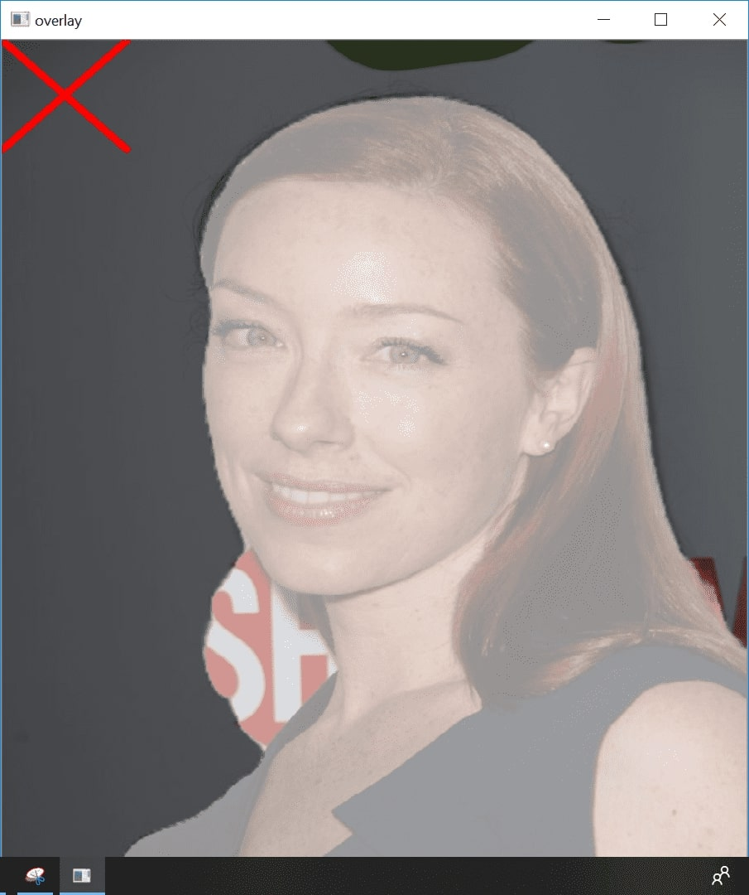

# Machine Learning Data Processing Tools

Tools for data filtering, preprocessing, and format conversion for ML tasks.

Currently support is only present for Computer Vision tasks

### Data Processing

-   [Tensorflow Image Augmentation Test](tf_image_augmentation_test)

-   [Training Data Filtering for Image Classification & Segmentation](training_data_cls_seg_filter)

|                                          
Good Matting
                                          |                                          
Bad Matting
                                          |
| :-------------------------------------------------------------------------------------------------------------: | :------------------------------------------------------------------------------------------------------------: |
|  |  |

-   [YOLO and Pascal VOC conversion for Object Detection Training](annotation_format_conv)

|                         
PASCAL VOC2007
                         |                         
YOLO
                         |
| :-----------------------------------------------------------------------------: | :-------------------------------------------------------------------: |
|  |  |

### Data Acquisition

-   [Youtube Downloader](youtube_downloader)
-   [icrawler](https://github.com/hellock/icrawler)
-   [Google, Bing Images Crawler](https://pypi.org/project/icrawler)
