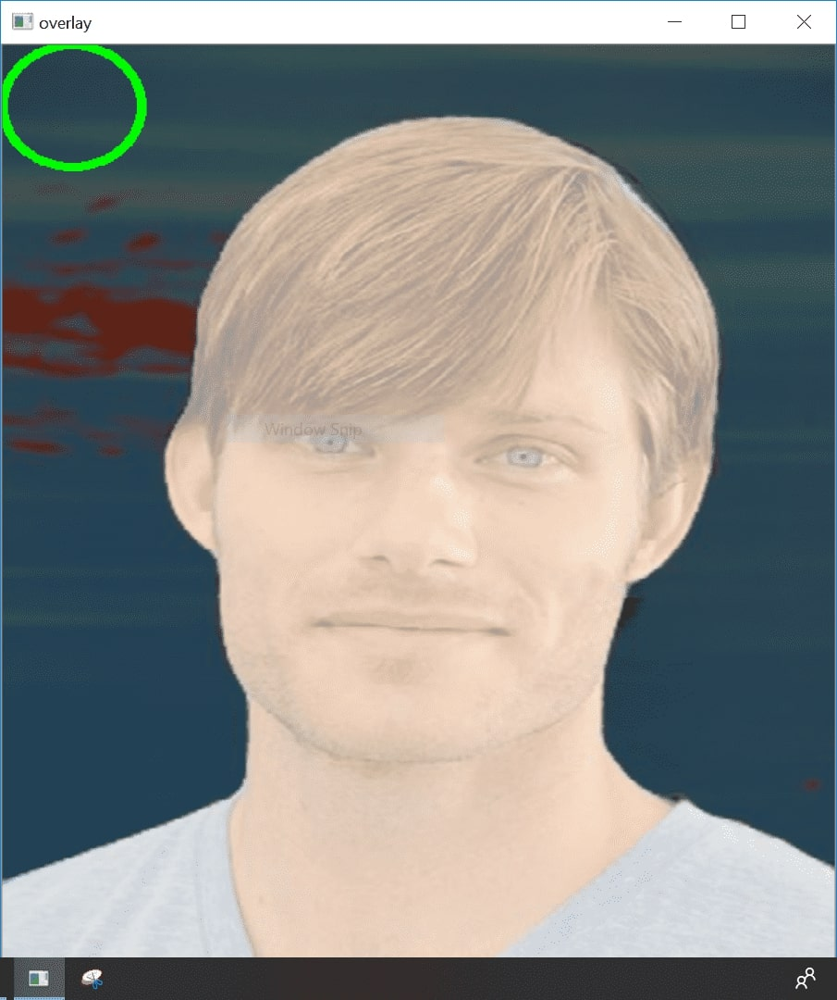
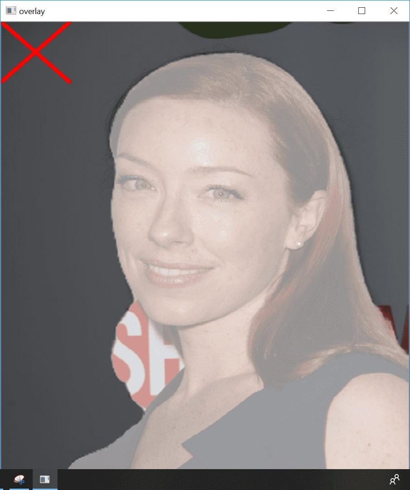

# Training Data Filtering

This is a GUI tool for manually filtering out images from [Matting Human Datasets](https://www.kaggle.com/laurentmih/aisegmentcom-matting-human-datasets). Results are saved to a local .csv file, and the progress will resume from where was left out last time.

Even though the dataset provides a large amount of images (34427), the quality of matting for most images are not very good, e.g. missing body parts, and scattered alpha values, which might suffocate the performance of a trained model. This tool aids user to mark down the good ones, and only use those for training purpose.

<p>


</p>

## Usage

```shell
$ python filter_img.py --clip_root data/img_orig/ --matting_root data/seg_orig/ --csv_save_path data/good_data.csv
# Shortened version
$ python filter_img.py -c data/img_orig/ -m data/seg_orig/ -s data/good_data.csv
```

-   D: Mark current image as 'bad', and move on to the next image.
-   A: Go back to the previous image.
-   W: Mark current image as 'good'.
-   S: Mark current image as 'bad'.
-   Esc: save and exit.

Each session the program will start from where was left out last time, and save the work when it exits. It also prints out the number of acculumated good images so far, so feel free to stop if you get enough images for training.

### To further inspect the images labelled as accepted (label 1) from the first step

```shell
$ python inspect_filtered_img.py -c data/img_orig/ -m data/seg_orig/ -f data/good_data.csv -s data/final_data.csv
```

## Acknowledgements

-   JoeHsiao &lt;<https://github.com/JoeHsiao> original repo <https://github.com/JoeHsiao/training_data_filtering>
